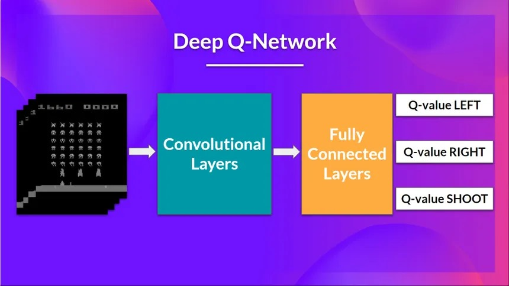
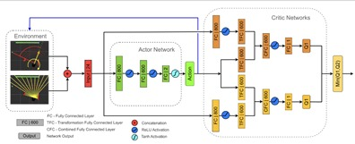
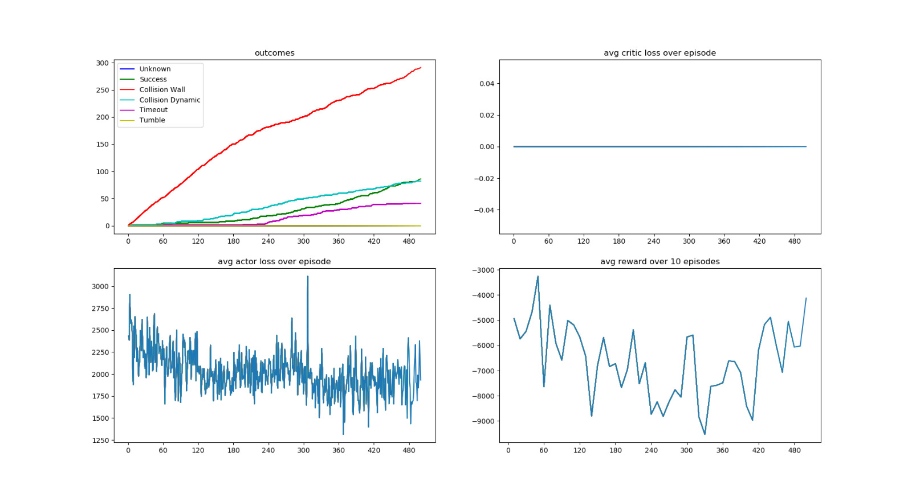
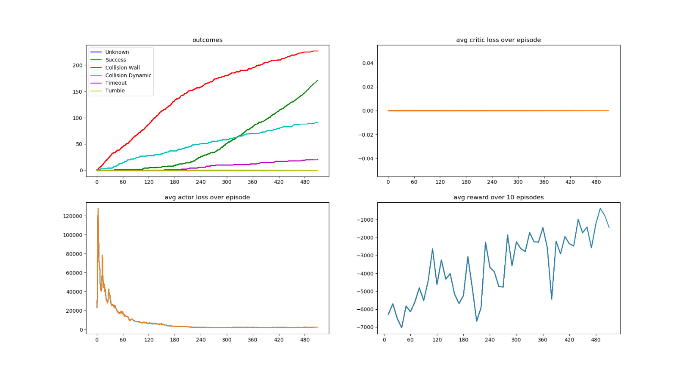
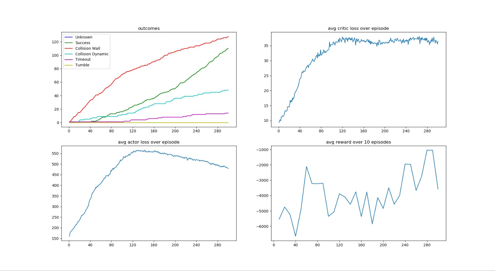
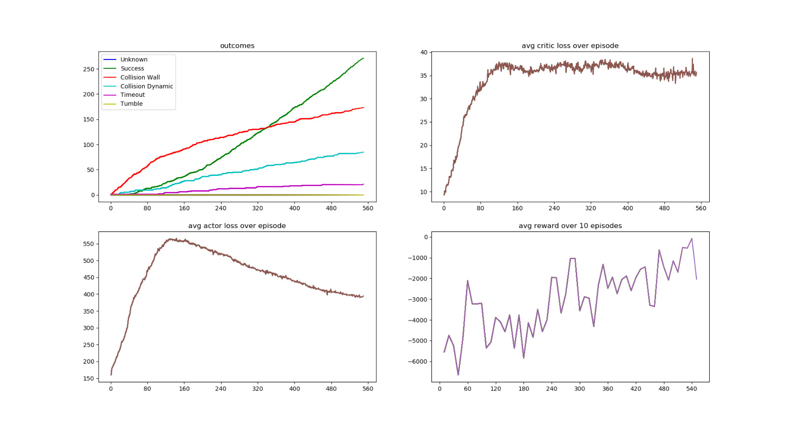

# Reinforcement Learning for Autonomous Navigation and Dynamic Obstacle Avoidance Utilizing Deep Q-Networks and Twin Delayed DDPG


## Table of Contents
- [Abstract](#abstract)
- [Introduction](#introduction)
  - [Motivation and Significance](#motivation-and-significance)
- [Features](#features)
- [Repository Structure](#repository-structure)
- [Installation](#installation)
  - [Docker Deployment (Recommended)](#docker-deployment-recommended)
  - [Manual Installation](#manual-installation)
    - [Prerequisites](#prerequisites)
    - [Installing ROS2](#installing-ros2)
    - [Installing Gazebo](#installing-gazebo)
    - [Setup Procedures](#setup-procedures)
- [Usage](#usage)
- [Algorithms](#algorithms)
  - [Deep Q-Network (DQN)](#deep-q-network-dqn)
    - [Unique Insights on DQN Implementation](#unique-insights-on-dqn-implementation)
  - [Twin Delayed Deep Deterministic Policy Gradient (TD3)](#twin-delayed-deep-deterministic-policy-gradient-td3)
    - [Unique Insights on TD3 Implementation](#unique-insights-on-td3-implementation)
- [Enhancements and Hyperparameter Optimization](#enhancements-and-hyperparameter-optimization)
  - [Unique Enhancements](#unique-enhancements)
- [Experimental Results](#experimental-results)
  - [DQN Algorithm Performance](#dqn-algorithm-performance)
  - [TD3 Algorithm Performance](#td3-algorithm-performance)
  - [Comparative Analysis](#comparative-analysis)
- [Discussion](#discussion)
- [Contributions](#contributions)
- [Future Work](#future-work)
  - [Unique Perspectives for Future Research](#unique-perspectives-for-future-research)
- [License](#license)
- [Contact Information](#contact-information)

**Note:** The comprehensive package surpasses GitHub's storage constraints. [Download it here](https://drive.google.com/drive/folders/1bEdnjlsKMCL4WyAYNA3v8UGTf5t-eK3h).

## Abstract
Autonomous navigation constitutes a quintessential research paradigm within robotics, endeavoring to amplify safety, efficacy, and operational autonomy across a plethora of applications, including but not limited to transportation, logistics, and personal robotics. This repository delineates the implementation of autonomous navigation for the TurtleBot3 platform, harnessing avant-garde reinforcement learning (RL) methodologies—specifically Deep Q-Networks (DQN) and Twin Delayed Deep Deterministic Policy Gradient (TD3). Executed within a simulated ROS2 Foxy and Gazebo 11 milieu, the project aspires to inculcate autonomous navigational proficiencies in TurtleBot3, enabling it to adeptly traverse complex environments while circumventing both dynamic and static impediments. Empirical evaluations elucidate substantial enhancements in navigation success rates and collision avoidance post hyperparameter optimization, thereby underscoring the efficacy of the employed algorithms. Furthermore, the comparative analysis between DQN and TD3 furnishes nuanced insights into their respective performance paradigms, contributing significantly to the extant corpus on intelligent robotic systems.

## Introduction
Autonomous navigation epitomizes a seminal frontier in robotic research, aspiring to endow robotic entities with the capability to maneuver through intricate and stochastic environments with minimal human intervention. This pursuit is instrumental in augmenting operational safety, optimizing task efficiency, and broadening the applicability of robotic systems across multifarious sectors. The present project scrutinizes the efficacy of two preeminent reinforcement learning algorithms—Deep Q-Networks (DQN) and Twin Delayed Deep Deterministic Policy Gradient (TD3)—in facilitating autonomous navigation and dynamic obstacle avoidance for the TurtleBot3 robot within a simulated ROS2 Gazebo environment. By leveraging these algorithms, the project endeavors to manifest substantial advancements in the robot's autonomous decision-making and adaptive maneuvering capabilities, thereby contributing profoundly to the broader discourse on intelligent robotic systems.

### Motivation and Significance
The impetus underpinning this project is derived from the escalating imperative for autonomous systems capable of operating reliably within dynamic and unpredictable milieus. Traditional rule-based navigation paradigms, while efficacious within controlled settings, exhibit limitations when confronted with environmental uncertainties and novel obstacles. Reinforcement learning, with its intrinsic capacity to discern optimal policies through environmental interactions, proffers a promising conduit to transcend these limitations. By implementing and juxtaposing DQN and TD3, this project seeks to elucidate the comparative strengths and inherent limitations of these algorithms in real-world-esque scenarios, thereby informing and shaping future advancements in autonomous robotics.

## Features
- **Autonomous Navigation:** Empowers the TurtleBot3 to traverse autonomously within a simulated milieu, demonstrating sophisticated decision-making and path planning.
- **Dynamic and Static Obstacle Avoidance:** Integrates advanced mechanisms to detect and evade both moving and stationary obstacles, ensuring collision-free navigation.
- **Advanced Algorithmic Implementation:** Employs state-of-the-art RL algorithms, DQN and TD3, to optimize the learning and decision-making processes of the robot.
- **Enhancements for Training Stability:** Incorporates learning rate schedulers and batch normalization to augment stability and convergence rates during training phases.
- **Comprehensive Hyperparameter Optimization:** Conducts extensive hyperparameter tuning to maximize algorithmic performance and efficiency.
- **Comparative Performance Analysis:** Provides a meticulous comparative evaluation of DQN and TD3 algorithms, elucidating their respective strengths and limitations.
- **Robust Evaluation Metrics:** Utilizes a suite of performance indicators, including navigation success rate, collision incidence, average network loss, and cumulative rewards, to rigorously assess algorithmic efficacy.

## Repository Structure
A perspicuous and methodically organized repository structure facilitates facile navigation and comprehension. Below is an overview of the project's directory hierarchy and salient files:

```
DQN-TD3-Autonomous-Navigation-and-Obstacle-Avoidance/
├── bash.sh
├── DQN/
│   ├── Testing/
│   │   ├── ep300.mkv
│   │   ├── ep500_2024-04-28_19.37.50.mkv
│   │   └── ep500_HP_2024-04-28_19.39.51.mkv
│   └── Training/
│       ├── ep001.mkv
│       ├── ep300.mkv
│       ├── ep500_2024-04-28_12.06.15.mkv
│       └── ep500_HP_2024-04-28_12.00.21.mkv
├── TD3/
│   ├── Testing/
│   │   ├── ep300_2024-04-28_19.48.35.mkv
│   │   └── ep500_HP_2024-04-28_19.42.13.mkv
│   └── Training/
│       ├── ep001_2024-04-21_16.04.57.mkv
│       ├── ep300_2024-04-28_11.55.27.mkv
│       └── ep500_2024-04-21_16.07.58.mkv
├── media/
│   ├── gifs/
│   │   ├── simulation.gif
│   │   └── visual.gif
│   └── images/
│       ├── dqn.jpeg
│       ├── dqnwith.jpeg
│       ├── dqnwithout.jpeg
│       ├── system_architecture.png
│       ├── td3.jpeg
│       ├── td3with.jpeg
│       └── td3without.jpeg
├── README.md
└── LICENSE
```

### Key Components:
- **bash.sh:** A shell script facilitating streamlined execution of common tasks and environment setups.
- **DQN/**: Encapsulates subdirectories for testing and training video recordings pertaining to the Deep Q-Network experiments.
  - **Testing/**: Archives video demonstrations of the DQN agent's performance across disparate episodes.
    - `ep300.mkv`, `ep500_2024-04-28_19.37.50.mkv`, `ep500_HP_2024-04-28_19.39.51.mkv`
  - **Training/**: Consolidates video recordings of the DQN training regimen, inclusive of hyperparameter-tuned sessions.
    - `ep001.mkv`, `ep300.mkv`, `ep500_2024-04-28_12.06.15.mkv`, `ep500_HP_2024-04-28_12.00.21.mkv`
- **TD3/**: Constitutes subdirectories for testing and training video recordings related to the Twin Delayed DDPG experiments.
  - **Testing/**: Houses video demonstrations of the TD3 agent's performance across varying episodes.
    - `ep300_2024-04-28_19.48.35.mkv`, `ep500_HP_2024-04-28_19.42.13.mkv`
  - **Training/**: Compiles video recordings of the TD3 training process, encompassing hyperparameter-tuned sessions.
    - `ep001_2024-04-21_16.04.57.mkv`, `ep300_2024-04-28_11.55.27.mkv`, `ep500_2024-04-21_16.07.58.mkv`
- **media/**: Retains assorted media files employed within the README for visual elucidations.
  - **gifs/**:
    - `simulation.gif`: An animated exegesis of the simulation environment.
    - `visual.gif`: Animated visualization exemplifying model evaluations.
  - **images/**:
    - `dqn.jpeg`, `dqnwith.jpeg`, `dqnwithout.jpeg`: Imageries depicting DQN performance metrics under diverse conditions.
    - `td3.jpeg`, `td3with.jpeg`, `td3without.jpeg`: Imageries illustrating TD3 performance metrics across various scenarios.
    - `system_architecture.png`: Diagrammatic representation delineating the system architecture of the project.
- **LICENSE:** Contains the licensing information governing the utilization and dissemination of the project.

## Installation

### Docker Deployment (Recommended)
To streamline the installation process and ensure an isolated, reproducible environment, the utilization of Docker is highly recommended. Docker containers encapsulate all requisite dependencies, mitigating potential conflicts and simplifying deployment.

1. **Install Docker:**
   Adhere to the official Docker installation guide meticulously tailored for Ubuntu [here](https://docs.docker.com/engine/install/ubuntu/).

2. **Enable GPU Acceleration (Optional):**
   For practitioners intending to harness GPU capabilities to expedite machine learning computations, ensure that NVIDIA drivers are duly installed. Subsequently, install the NVIDIA Docker toolkit by following the instructions [here](https://docs.nvidia.com/datacenter/cloud-native/container-toolkit/install-guide.html).

3. **Clone the Repository and Construct the Docker Image:**
   ```bash
   git clone https://github.com/Rishikesh-Jadhav/Reinforcement-Learning-for-Autonomous-Navigation-using-Deep-Q-Network-and-Twin-Delayed-DDPG.git
   cd Reinforcement-Learning-for-Autonomous-Navigation-using-Deep-Q-Network-and-Twin-Delayed-DDPG
   docker build -t autonomous-nav .
   ```

4. **Instantiate the Docker Container:**
   ```bash
   docker run --gpus all -it --rm autonomous-nav
   ```

### Manual Installation
Should Docker not present itself as a viable option, manual installation of dependencies is feasible. The following delineates the requisite steps:

#### Prerequisites
- **Operating System:** Ubuntu 20.04 LTS
- **ROS2 Distribution:** Foxy Fitzroy
- **Simulation Environment:** Gazebo 11.0
- **Programming Language:** Python 3.8+
- **Machine Learning Framework:** PyTorch 1.10.0

#### Installing ROS2
1. **Adhere to the Official Installation Guide:**
   Install ROS2 Foxy by following the comprehensive instructions [here](https://docs.ros.org/en/foxy/Installation/Ubuntu-Install-Debians.html). Opt for either the Desktop or Bare Bones installation contingent upon your requirements.

2. **Automate ROS2 Sourcing:**
   Incorporate the following command into your `~/.bashrc` to ensure ROS2 is sourced automatically upon terminal initiation:
   ```bash
   echo "source /opt/ros/foxy/setup.bash" >> ~/.bashrc
   source ~/.bashrc
   ```
   For an in-depth guide, refer to [this resource](https://automaticaddison.com/how-to-install-ros-2-foxy-fitzroy-on-ubuntu-linux/).

#### Installing Gazebo
1. **Install Gazebo 11.0:**
   Navigate to the [Gazebo installation page](http://gazebosim.org/tutorials?tut=install_ubuntu) and select version 11.0. Follow the default installation directives meticulously.

2. **Install ROS2-Gazebo Integration Packages:**
   ```bash
   sudo apt update
   sudo apt install ros-foxy-gazebo-ros-pkgs
   ```

3. **Install Additional ROS2 Packages for Demonstration:**
   ```bash
   sudo apt install ros-foxy-ros-core ros-foxy-geometry2
   ```

4. **Source ROS2 Environment:**
   ```bash
   source /opt/ros/foxy/setup.bash
   ```

#### Setup Procedures
1. **Clone the Repository:**
   ```bash
   git clone https://github.com/Rishikesh-Jadhav/Reinforcement-Learning-for-Autonomous-Navigation-using-Deep-Q-Network-and-Twin-Delayed-DDPG.git
   cd Reinforcement-Learning-for-Autonomous-Navigation-using-Deep-Q-Network-and-Twin-Delayed-DDPG
   ```

2. **Install Python Dependencies:**
   ```bash
   sudo apt update
   sudo apt install python3-pip
   pip3 install -r requirements.txt
   ```

3. **Source ROS2 and Initialize Environment:**
   ```bash
   source /opt/ros/foxy/setup.bash
   ```

## Usage

1. **Initialize the Gazebo Simulation:**
   Launch the Gazebo simulation environment by executing:
   ```bash
   ros2 launch turtlebot3_gazebo turtlebot3_world.launch.py
   ```

2. **Execute Training with Deep Q-Network (DQN):**
   In a separate terminal, navigate to the project directory and initiate training via:
   ```bash
   python3 train_dqn.py
   ```
   - **Training Videos Location:** `DQN/Training/`
     - Example: `DQN/Training/ep500_HP_2024-04-28_12.00.21.mkv`

3. **Execute Training with Twin Delayed DDPG (TD3):**
   Open an additional terminal, traverse to the project directory, and commence training with:
   ```bash
   python3 train_td3.py
   ```
   - **Training Videos Location:** `TD3/Training/`
     - Example: `TD3/Training/ep500_2024-04-21_16.07.58.mkv`

4. **Evaluate Trained Models:**
   Upon completion of the training phase, assess the models' efficacy by running:
   ```bash
   python3 evaluate.py
   ```
   - **Evaluation Videos Location:**
     - **DQN Testing:** `DQN/Testing/`
       - Example: `DQN/Testing/ep500_HP_2024-04-28_19.39.51.mkv`
     - **TD3 Testing:** `TD3/Testing/`
       - Example: `TD3/Testing/ep500_HP_2024-04-28_19.42.13.mkv`

   

### Additional Functionalities
- **Real-Time Monitoring:** The system architecture, visualized in `media/images/system_architecture.png`, elucidates the real-time data flow between the TurtleBot3, ROS2 nodes, and the reinforcement learning agents, facilitating seamless integration and monitoring.
- **Performance Logging:** Comprehensive logs are maintained during training and testing phases, enabling in-depth analysis and reproducibility of results.

## Algorithms

### Deep Q-Network (DQN)
The Deep Q-Network (DQN) is a quintessential model-free, off-policy reinforcement learning algorithm that approximates the action-value (Q-value) function through the utilization of deep neural networks. DQN processes the current state as input and generates Q-values corresponding to all feasible actions. An ϵ-greedy policy is employed to orchestrate action selection, thereby harmonizing exploration and exploitation to facilitate effective learning.



#### Unique Insights on DQN Implementation
- **Experience Replay:** DQN leverages experience replay buffers to obviate temporal correlations inherent in sequential data, thereby enhancing the stability and efficacy of the learning process.
- **Target Network Stabilization:** The deployment of a separate target network in DQN mitigates the propensity for divergence during training by furnishing consistent target values, thus fostering stable convergence.
- **Integration Challenges:** Balancing the exploration-exploitation dichotomy was paramount in optimizing DQN's performance, particularly within dynamic environments characterized by unpredictably varying obstacle configurations.

### Twin Delayed Deep Deterministic Policy Gradient (TD3)
Twin Delayed Deep Deterministic Policy Gradient (TD3) represents an avant-garde actor-critic algorithm meticulously engineered for continuous action spaces. TD3 ameliorates the inherent overestimation bias observed in Deep Deterministic Policy Gradient (DDPG) by integrating twin Q-networks, thereby enhancing estimation accuracy. Additionally, TD3 enforces delayed policy updates relative to Q-networks, which contributes to augmented training stability and convergence.



#### Unique Insights on TD3 Implementation
- **Twin Q-Networks:** The incorporation of twin Q-networks in TD3 significantly attenuates overestimation bias, leading to more reliable value approximations and improved policy performance.
- **Policy Delays:** Delaying policy updates ensures that the actor network assimilates more stable and refined policies, thereby enhancing overall performance and robustness.
- **Continuous Action Handling:** TD3's proficiency in managing continuous action spaces renders it particularly adept for nuanced navigation tasks where precise and fluid movements are imperative.

## Enhancements and Hyperparameter Optimization
To elevate the performance and robustness of both DQN and TD3 algorithms, the following methodological enhancements and hyperparameter optimization strategies were meticulously implemented:

- **Learning Rate Scheduler:** Utilizes dynamic adjustment of the learning rate throughout the training epochs to expedite convergence and obviate oscillations.
- **Batch Normalization:** Incorporates batch normalization layers to standardize inputs across mini-batches, thereby stabilizing and accelerating the training process.
- **Epsilon Decay (for DQN):** Implements a gradual diminution of the exploration rate, thereby transitioning the policy from exploration to exploitation over time.
- **Target Update Frequency (for DQN):** Establishes periodic updates to the target Q-network at fixed intervals, ensuring the maintenance of stable target values.
- **Policy Update Frequency (for TD3):** Enforces delayed updates to the policy network relative to Q-networks, mitigating potential destabilizing perturbations during training.
- **Reward Shaping:** Carefully architected reward functions to incentivize desired behaviors and disincentivize collisions, thereby enhancing the learning efficacy.
- **Network Architecture Optimization:** Fine-tuned the neural network architectures, including the number of layers and neurons, to balance computational efficiency and representational capacity.

### Unique Enhancements
- **Adaptive Exploration Strategies:** Beyond traditional epsilon-greedy policies, adaptive exploration strategies were explored to dynamically adjust exploration rates based on the agent's performance trajectory, fostering more efficient and targeted learning.
- **Curriculum Learning:** Implemented a curriculum learning paradigm wherein the complexity of the environment incrementally escalated, thereby enabling the agent to assimilate foundational skills prior to engaging with more formidable scenarios.

## Experimental Results
The efficacy of both DQN and TD3 algorithms was empirically evaluated based on a suite of performance metrics, including navigation success rate, collision incidence, average network loss, and cumulative rewards. The ensuing results are elucidated through comprehensive graphical representations, delineating the comparative performance trajectories of the two algorithms.

### DQN Algorithm Performance
- **Without Hyperparameter Optimization:**
  - Elevated collision incidence rates
  - Diminished navigation success probabilities
  - Substantial and fluctuating average critic loss
  - Inconsistent and unstable average rewards
  
  - **Video Demonstration:** `DQN/Testing/ep300.mkv`

- **With Hyperparameter Optimization:**
  - Augmented navigation success rates
  - Substantial reduction in collision occurrences
  - Stabilized and reduced average critic loss
  - Consistent and upward trajectory in average rewards
  
  - **Video Demonstration:** `DQN/Testing/ep500_HP_2024-04-28_19.39.51.mkv`

### TD3 Algorithm Performance
- **Without Hyperparameter Optimization:**
  - Elevated collision incidence rates
  - Diminished navigation success probabilities
  - Substantial and fluctuating average critic loss
  - Inconsistent and unstable average rewards
  
  - **Video Demonstration:** `TD3/Testing/ep300_2024-04-28_19.48.35.mkv`

- **With Hyperparameter Optimization:**
  - Significant attenuation of collision rates
  - Enhanced navigation success metrics
  - Stabilized and reduced average critic loss
  - Consistent and upward trajectory in average rewards
  
  - **Video Demonstration:** `TD3/Testing/ep500_HP_2024-04-28_19.42.13.mkv`

### Comparative Analysis
The comparative analysis accentuates the superior performance of TD3 over DQN in continuous action spaces, particularly within complex and dynamic environments. TD3's architectural innovations effectively mitigate overestimation biases and ensure more stable learning trajectories, culminating in elevated navigation success rates and diminished collision incidences. Conversely, while DQN demonstrates commendable capabilities, its performance exhibits greater susceptibility to fluctuations in unstable environments sans meticulous hyperparameter tuning.

## Discussion
The implementation of DQN and TD3 for autonomous navigation and dynamic obstacle avoidance on the TurtleBot3 platform has yielded insightful findings and elucidated several critical facets of reinforcement learning in robotics.

### Algorithmic Efficacy
- **DQN's Limitations:** DQN, inherently architected for discrete action spaces, encountered challenges in adeptly managing the continuous nature of robotic movements, necessitating discretization of actions, which potentially constrains maneuvering precision and fluidity.
- **TD3's Strengths:** TD3's inherent suitability for continuous action spaces rendered it more adept at managing the nuanced control requisites for autonomous navigation, resulting in smoother and more accurate movements, thereby enhancing overall navigational efficacy.

### Environmental Complexity
- **Dynamic Obstacles:** The incorporation of dynamic obstacles introduced non-stationary elements, compelling the agents to adapt their policies in real-time. Both algorithms benefited from the stability enhancements; however, TD3 manifested a more robust adaptation mechanism, thereby sustaining superior performance amidst environmental stochasticity.
- **Simulation Fidelity:** The Gazebo 11 environment proffered a realistic simulation framework, albeit certain simplifications were necessitated. Future iterations could assimilate more sophisticated physics and sensor models to further attenuate the simulation-reality discrepancy, thereby enhancing the generalizability of the trained models.

### Training Stability and Convergence
- **Hyperparameter Sensitivity:** Both DQN and TD3 exhibited pronounced sensitivity to hyperparameter configurations, with optimal settings being paramount for actualizing desirable performance metrics. The integration of learning rate schedulers and batch normalization proved instrumental in bolstering training stability and facilitating convergence.
- **Overfitting Concerns:** Prolonged training regimens harbored the potential for overfitting to specific environmental patterns. Implementing regularization techniques and diversifying obstacle configurations can attenuate such proclivities, thereby fostering more generalized and robust policies.

### Scalability and Generalization
- **Transferability:** The trained models demonstrated a commendable degree of generalization within the simulated environment. However, assessing their transferability to heterogeneous or real-world settings remains an open avenue for exploration, necessitating further empirical validation.
- **Scalability:** Scaling the algorithms to more intricate environments with heightened obstacle densities and varied terrains posits additional challenges, necessitating further architectural and methodological refinements to sustain performance efficacy.

### Ethical and Practical Implications
- **Safety Considerations:** Ensuring the safety and reliability of autonomous systems is paramount, especially when transitioning from simulation to real-world deployment. Incorporating safety constraints and fail-safes within the learning framework is imperative to preclude inadvertent collisions and ensure operational integrity.
- **Resource Efficiency:** Balancing computational resource requisites with performance gains is crucial, particularly for deployment on resource-constrained platforms. Optimizing network architectures and leveraging efficient training paradigms can address this concern, thereby fostering sustainable and scalable autonomous systems.

## Contributions
Substantial contributions to this project encompass:

- **Learning Rate Scheduler Integration:** Incorporated a dynamic learning rate scheduler to facilitate efficient convergence and mitigate training oscillations, thereby enhancing the stability and speed of the learning process.
- **Batch Normalization Implementation:** Integrated batch normalization layers within neural network architectures to stabilize and expedite the training process, thereby augmenting the model's ability to generalize across diverse states.
- **Comprehensive Hyperparameter Optimization:** Executed extensive hyperparameter tuning to optimize the performance metrics of DQN and TD3 algorithms, thereby maximizing their efficacy and robustness.
- **Comparative Performance Analysis:** Conducted a rigorous comparative analysis of DQN and TD3 algorithms, elucidating their respective performance paradigms, strengths, and limitations, thereby contributing valuable insights to the reinforcement learning community.
- **Innovative Training Strategies:** Implemented curriculum learning and adaptive exploration strategies to enhance learning efficiency and policy robustness, thereby fostering more resilient and adaptable agents.
- **Robust Evaluation Framework:** Developed a comprehensive evaluation framework incorporating diverse performance metrics and qualitative assessments through video demonstrations, thereby ensuring thorough and multifaceted assessment of algorithmic efficacy.
- **Script Automation:** The inclusion of `bash.sh` facilitates streamlined execution of repetitive tasks and environment setups, enhancing user convenience and reducing manual intervention.

All source code pertinent to the training and evaluation of DQN and TD3 algorithms on the TurtleBot3 platform is meticulously documented and accessible within this repository.

## Future Work

Prospective advancements for this project may involve:

- **Deployment in Complex Environments:** Extending algorithmic applications to more intricate and expansive environments to assess scalability and adaptability, thereby broadening the operational scope of the autonomous agents.
- **Sensor Fusion Integration:** Incorporating additional sensory modalities and fusion techniques to enhance environmental perception and decision-making accuracy, thereby augmenting the agents' situational awareness and responsiveness.
- **Exploration of Alternative Algorithms:** Investigating other reinforcement learning paradigms and hybrid methodologies to further augment navigation performance and robustness, thereby diversifying the algorithmic arsenal.
- **Real-World Implementation:** Transitioning from simulation to physical deployment on TurtleBot3 hardware to validate real-world applicability and performance, thereby bridging the simulation-reality gap.
- **Adaptive Learning Mechanisms:** Integrating meta-learning and continual learning approaches to enable agents to adapt to evolving environmental dynamics without necessitating retraining from inception, thereby fostering more autonomous and self-sufficient systems.
- **Collaborative Multi-Agent Systems:** Exploring multi-agent reinforcement learning frameworks to facilitate coordinated navigation and obstacle avoidance in scenarios involving multiple robots, thereby enhancing collective operational efficiency.
- **Human-Robot Interaction:** Investigating how human inputs and interactions can be seamlessly integrated into the autonomous navigation framework, enhancing collaborative tasks and ensuring harmonious human-robot coexistence.
- **Energy Efficiency Optimization:** Balancing navigation efficacy with energy consumption metrics to develop sustainable and long-lasting autonomous systems, thereby addressing practical deployment constraints.
- **Explainability and Transparency:** Developing interpretable models that provide insights into decision-making processes, fostering trust and reliability in autonomous agents, and facilitating accountability in critical applications.

### Unique Perspectives for Future Research
- **Human-Robot Interaction:** Investigating how human inputs and interactions can be seamlessly integrated into the autonomous navigation framework, enhancing collaborative tasks and ensuring harmonious human-robot coexistence.
- **Energy Efficiency Optimization:** Balancing navigation efficacy with energy consumption metrics to develop sustainable and long-lasting autonomous systems, thereby addressing practical deployment constraints.
- **Explainability and Transparency:** Developing interpretable models that provide insights into decision-making processes, fostering trust and reliability in autonomous agents, and facilitating accountability in critical applications.

## License
This project is disseminated under the MIT License. Refer to the [LICENSE](LICENSE) file for comprehensive licensing details.

## Contact Information
For further information, inquiries, or collaborative opportunities, please contact the principal contributor:

**James Suchor**  
Email: [jsuchor@zagmail.gonzaga.edu](mailto:jsuchor@zagmail.gonzaga.edu)
