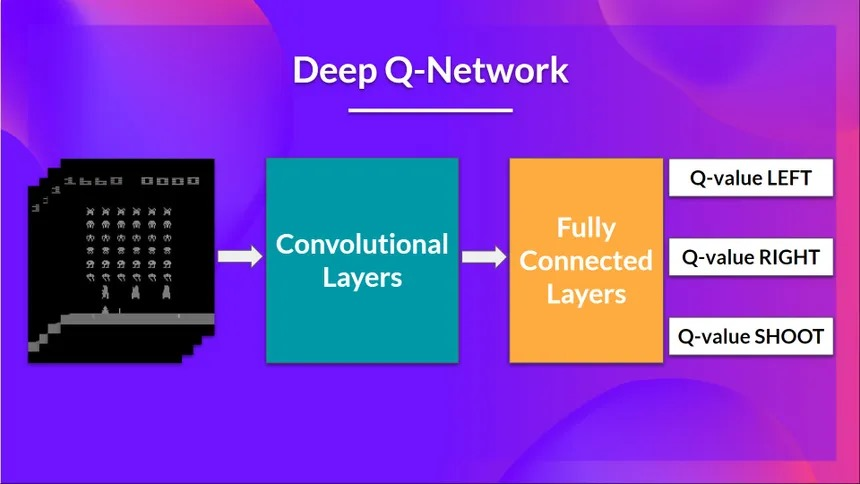
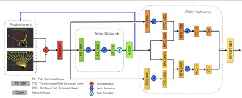
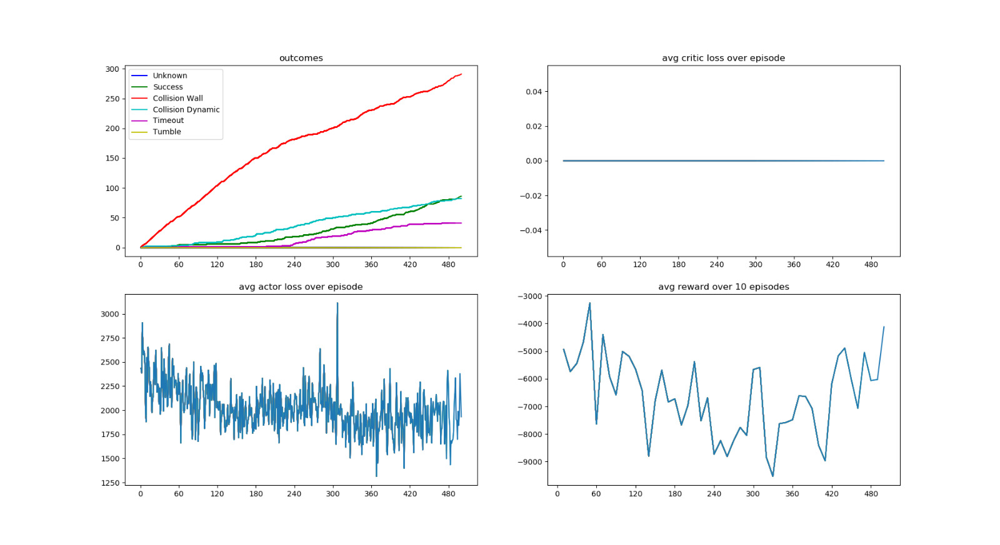
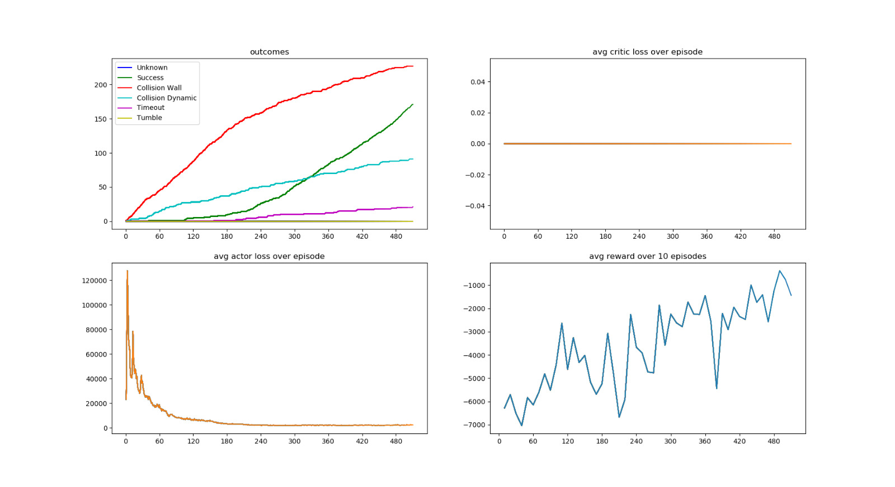
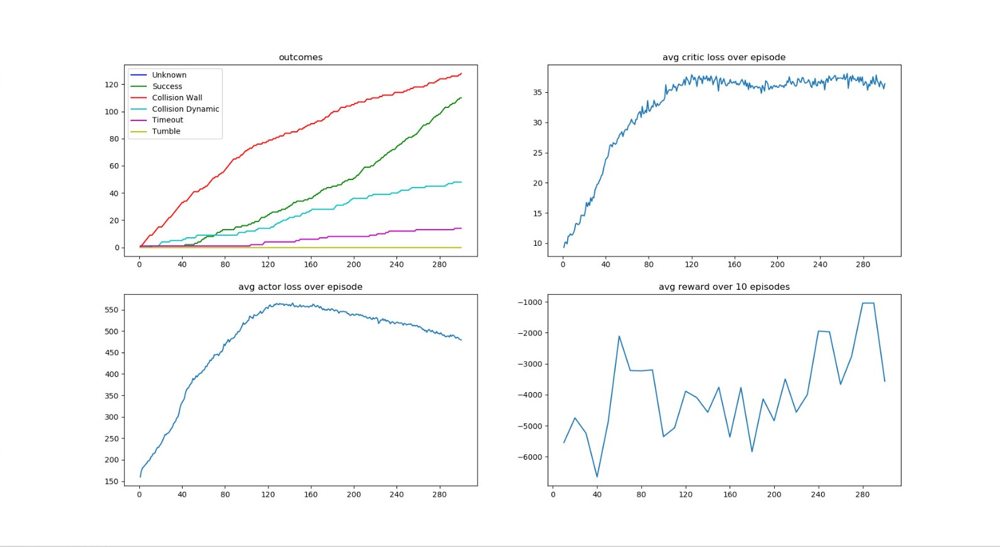
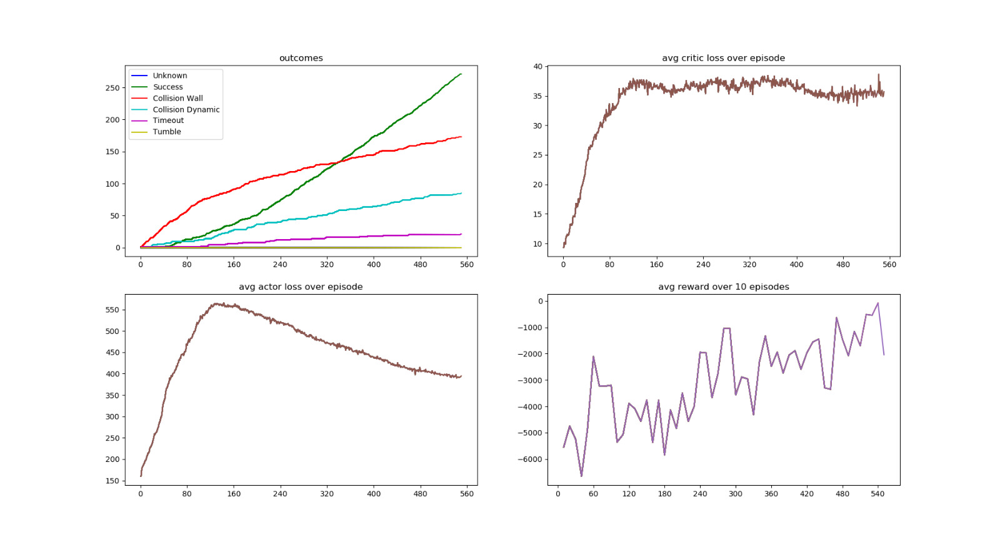

# Reinforcement Learning for Autonomous Navigation and Dynamic Obstacle Avoidance using Deep Q-Network and Twin Delayed DDPG

This repository showcases the implementation of autonomous navigation for a TurtleBot3 robot using reinforcement learning (RL) techniques, specifically leveraging Deep Q-Networks (DQN) and Twin Delayed Deep Deterministic Policy Gradient (TD3) algorithms. The project is developed within a simulated ROS2 Foxy and Gazebo 11 environment, aiming to train the TurtleBot3 to navigate autonomously while effectively avoiding dynamic obstacles.


## Table of Contents
- [Introduction](#introduction)
- [Features](#features)
- [Installation](#installation)
  - [Docker Installation (Recommended)](#docker-installation-recommended)
  - [Manual Installation](#manual-installation)
    - [Prerequisites](#prerequisites)
    - [Installing ROS2](#installing-ros2)
    - [Installing Gazebo](#installing-gazebo)
    - [Setup Steps](#setup-steps)
- [Usage](#usage)
- [Algorithms](#algorithms)
  - [Deep Q-Network (DQN)](#deep-q-network-dqn)
  - [Twin Delayed Deep Deterministic Policy Gradient (TD3)](#twin-delayed-deep-deterministic-policy-gradient-td3)
- [Enhancements and Hyperparameter Tuning](#enhancements-and-hyperparameter-tuning)
- [Results](#results)
  - [DQN Algorithm Performance](#dqn-algorithm-performance)
  - [TD3 Algorithm Performance](#td3-algorithm-performance)
- [Contribution](#contribution)
- [Future Work](#future-work)
- [Contact](#contact)

**Note:** The final package is too large for GitHub. [Download it here](https://drive.google.com/drive/folders/1bEdnjlsKMCL4WyAYNA3v8UGTf5t-eK3h).

## Introduction
Autonomous vehicle navigation is a critical research area in robotics, aiming to enhance safety, efficiency, and accessibility across various sectors such as transportation, logistics, and personal robotics. This project investigates the application of two leading RL algorithms—Deep Q-Networks (DQN) and Twin Delayed Deep Deterministic Policy Gradient (TD3)—to enable the TurtleBot3 robot to navigate autonomously in a simulated ROS Gazebo environment while avoiding both static and dynamic obstacles.

## Features
- **Autonomous Navigation:** Enables TurtleBot3 to navigate autonomously within a simulated environment.
- **Obstacle Avoidance:** Handles both dynamic and static obstacles effectively.
- **Algorithm Implementation:** Incorporates DQN and TD3 algorithms for training.
- **Enhancements:** Utilizes learning rate schedulers and batch normalization to improve training stability and performance.
- **Hyperparameter Tuning:** Extensive tuning to optimize algorithm performance.
- **Comparative Analysis:** Evaluates and compares the performance of DQN and TD3.

## Installation

### Docker Installation (Recommended)
To simplify the installation process and quickly set up the environment, it is recommended to use Docker. Docker allows you to run applications within isolated containers, ensuring all dependencies are correctly installed.

1. **Install Docker:**
   Follow the official Docker installation guide for Ubuntu [here](https://docs.docker.com/engine/install/ubuntu/).

2. **Enable GPU Support (Optional):**
   If you intend to utilize GPU acceleration for machine learning models, ensure you have the NVIDIA drivers installed on your system. Then, install the NVIDIA Docker toolkit by following the instructions [here](https://docs.nvidia.com/datacenter/cloud-native/container-toolkit/install-guide.html).

3. **Clone the Repository and Build the Docker Image:**
   ```bash
   git clone https://github.com/Rishikesh-Jadhav/Reinforcement-Learning-for-Autonomous-Navigation-using-Deep-Q-Network-and-Twin-Delayed-DDPG.git
   cd Reinforcement-Learning-for-Autonomous-Navigation-using-Deep-Q-Network-and-Twin-Delayed-DDPG
   docker build -t autonomous-nav .
   ```

4. **Run the Docker Container:**
   ```bash
   docker run --gpus all -it --rm autonomous-nav
   ```

### Manual Installation

If you prefer not to use Docker, you can install all dependencies manually.

#### Prerequisites
- **Operating System:** Ubuntu 20.04 LTS
- **ROS2 Distribution:** Foxy Fitzroy
- **Simulation Environment:** Gazebo 11.0
- **Programming Language:** Python 3.8+
- **Machine Learning Framework:** PyTorch 1.10.0

#### Installing ROS2
1. **Follow the Official Installation Guide:**
   Install ROS2 Foxy by following the instructions [here](https://docs.ros.org/en/foxy/Installation/Ubuntu-Install-Debians.html). You can choose either the Desktop or Bare Bones installation.

2. **Source ROS2 Automatically:**
   Add the following line to your `~/.bashrc` to source ROS2 automatically:
   ```bash
   echo "source /opt/ros/foxy/setup.bash" >> ~/.bashrc
   source ~/.bashrc
   ```
   For more detailed instructions, refer to [this guide](https://automaticaddison.com/how-to-install-ros-2-foxy-fitzroy-on-ubuntu-linux/).

#### Installing Gazebo
1. **Install Gazebo 11.0:**
   Visit the [Gazebo installation page](http://gazebosim.org/tutorials?tut=install_ubuntu) and select version 11.0. Follow the default installation instructions provided.

2. **Install ROS2-Gazebo Integration Packages:**
   ```bash
   sudo apt update
   sudo apt install ros-foxy-gazebo-ros-pkgs
   ```

3. **Install Additional ROS2 Packages for Demo:**
   ```bash
   sudo apt install ros-foxy-ros-core ros-foxy-geometry2
   ```

4. **Source ROS2:**
   ```bash
   source /opt/ros/foxy/setup.bash
   ```

#### Setup Steps
1. **Clone the Repository:**
   ```bash
   git clone https://github.com/Rishikesh-Jadhav/Reinforcement-Learning-for-Autonomous-Navigation-using-Deep-Q-Network-and-Twin-Delayed-DDPG.git
   cd Reinforcement-Learning-for-Autonomous-Navigation-using-Deep-Q-Network-and-Twin-Delayed-DDPG
   ```

2. **Install Python Dependencies:**
   ```bash
   sudo apt update
   sudo apt install python3-pip
   pip3 install -r requirements.txt
   ```

3. **Source ROS2 and Setup Environment:**
   ```bash
   source /opt/ros/foxy/setup.bash
   ```

## Usage

1. **Launch the Gazebo Simulation:**
   Open a terminal and run:
   ```bash
   ros2 launch turtlebot3_gazebo turtlebot3_world.launch.py
   ```

2. **Train with Deep Q-Network (DQN):**
   In a new terminal, navigate to the project directory and execute:
   ```bash
   python3 train_dqn.py
   ```

3. **Train with Twin Delayed DDPG (TD3):**
   Open another terminal, navigate to the project directory, and run:
   ```bash
   python3 train_td3.py
   ```

4. **Evaluate Trained Models:**
   After training, evaluate the performance by executing:
   ```bash
   python3 evaluate.py
   ```

   

## Algorithms

### Deep Q-Network (DQN)
DQN is a model-free, off-policy reinforcement learning algorithm that approximates the Q-value function using a deep neural network. It takes the current state as input and outputs Q-values for all possible actions. An ϵ-greedy policy is employed to select actions, balancing exploration and exploitation.



### Twin Delayed Deep Deterministic Policy Gradient (TD3)
TD3 is an actor-critic algorithm tailored for continuous action spaces. It enhances the Deep Deterministic Policy Gradient (DDPG) by mitigating overestimation bias and improving learning stability. TD3 utilizes twin Q-networks to reduce overestimation and delays policy updates to ensure more stable training.



## Enhancements and Hyperparameter Tuning
To boost the performance and stability of both DQN and TD3 algorithms, the following enhancements and hyperparameter tuning techniques were implemented:

- **Learning Rate Scheduler:** Dynamically adjusts the learning rate during training to facilitate efficient convergence.
- **Batch Normalization:** Normalizes the inputs of each layer, stabilizing and accelerating the training process.
- **Epsilon Decay (for DQN):** Gradually decreases the probability of choosing random actions, balancing exploration and exploitation.
- **Target Update Frequency (for DQN):** Updates the target Q-network at fixed intervals to maintain stable target values.
- **Policy Update Frequency (for TD3):** Delays policy network updates relative to Q-networks to prevent destabilizing changes.

## Results
The training outcomes for both DQN and TD3 algorithms were evaluated based on metrics such as navigation success rate, collision rate, average network loss, and average rewards. The results are visualized through graphical representations to highlight performance differences.

### DQN Algorithm Performance
- **Without Hyperparameter Tuning:**
  - High collision rates
  - Low navigation success
  - High and variable average critic loss
  - Unstable average rewards
  
  
- **With Hyperparameter Tuning:**
  - Enhanced navigation success
  - Reduced collision rates
  - Stabilized and lower average critic loss
  - Consistent upward trend in average rewards
  

### TD3 Algorithm Performance
- **Without Hyperparameter Tuning:**
  - High collision rates
  - Low navigation success
  - High and variable average critic loss
  - Unstable average rewards
  
  
- **With Hyperparameter Tuning:**
  - Significant reduction in collisions
  - Higher navigation success rates
  - Stabilized and lower average critic loss
  - Consistent upward trend in average rewards
  

## Contribution
Significant contributions to this project include:

- **Learning Rate Scheduler:** Integrated a scheduler to dynamically adjust the learning rate, promoting efficient convergence.
- **Batch Normalization:** Added batch normalization layers to stabilize and accelerate the training process.
- **Hyperparameter Tuning:** Conducted extensive tuning to optimize the performance of DQN and TD3 algorithms.
- **Comparative Analysis:** Performed a comprehensive comparative analysis of the DQN and TD3 algorithms, highlighting their strengths and weaknesses.

All code related to training and testing the DQN and TD3 algorithms on TurtleBot3 is available in this repository.

## Future Work
Future enhancements for this project may involve:

- **Complex Environments:** Extending the algorithms to operate in more intricate and larger-scale environments.
- **Sensor Integration:** Incorporating additional sensors and sensor fusion techniques to improve perception capabilities.
- **Exploring Additional Algorithms:** Investigating other reinforcement learning algorithms and hybrid approaches to further enhance navigation performance.
- **Real-World Testing:** Implementing and validating the trained models on physical TurtleBot3 robots to assess real-world applicability.

## Contact
For more information or inquiries, please reach out to the main contributor:

**James Suchor**  
Email: [jsuchor@zagmail.gonzaga.edu](mailto:jsuchor@zagmail.gonzaga.edu)
